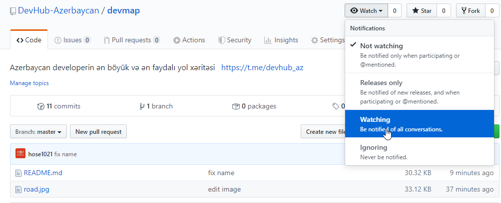

# Azerbaycan developerin ən böyük və ən faydalı yol xəritəsi © [DevHub](https://t.me/devhub_az)

> Repo hələ də demo versiyasındadır və daim yenilənir və tərcümə olunur. Əgər nəsə əlavə və dəyişiklik təklifiniz olsa [burda](https://github.com/DevHub-Azerbaycan/devmap/issues) yaza bilərsiz.

---
## Yeniləmələri izləmək üçün bu düyməsinə basın

---
## Mündəricat
- [**Hər bir developer bilməlidir:**](#hər-bir-developer-bilməlidir-)
    - [ ] [Kitablar](#kitablar-)
    - [ ] [İngilis dili](#İngilis-dili-)
    - [ ] [Kompüter arxitekturası](#kompüter-arxitekturası-)
    - [ ] [Linux Bash əmr xətti](#linux-bash-əmr-xətti-)
    - [ ] [Məlumat strukturları](#məlumat-strukturları-)
    - [ ] [HTML & CSS](#html--css-)
    - [ ] [Obyekt yönümlü proqramlaşdırma](#obyekt-yönümlü-proqramlaşdırma-)
    - [ ] [Funksional proqramlaşdırma](#Функциональное-программирование-)
    - [ ] [Versiyaya nəzarət sistemləri](#versiyaya-nəzarət-sistemləri-)
    - [ ] [HTTP protokolu](#http-protokolu-)
    - [ ] [Testlər](#testlər-)
    - [ ] [Veb təhlükəsizliyi](#veb-təhlükəsizliyi-)
    - [ ] [Vaxtın idarə olunması](#vaxtın-idarə-olunması-)

- [**Back-end developerin yol xəritəsi:**](#Back-end-developerin-yol-xəritəsi-)
    - [ ] [Алгоритмы](#Алгоритмы-)
    - [ ] [Серверные языки программирования](#Серверные-языки-программирования-)
    - [ ] [Паттерны программирования](#Паттерны-программирования-)
    - [ ] [Принципы программирования](#Принципы-программирования-)
    - [ ] [Регулярные выражения](#Регулярные-выражения-)
    - [ ] [SQL](#sql-)
    - [ ] [Проектирование баз данных](#Проектирование-баз-данных-)
    - [ ] [Фреймворки](#Фреймворки-)
    - [ ] [Пакетный менеджер](#Пакетный-менеджер-)
    - [ ] [Устройство веб-серверов и способы взаимодействия](#Устройство-веб-серверов-и-способы-взаимодействия-)
    - [ ] [Развертывание проектов](#Развертывание-проектов-)

- [**Front-end developerin yol xəritəsi:**](#Front-end-developerin-yol-xəritəsi-)
    - [ ] [JavaScript](#javascript-)
    - [ ] [Адаптивный/отзывчивый веб-дизайн](#Адаптивныйотзывчивый-веб-дизайн-)
    - [ ] [JavaScript библиотеки](#javascript-библиотеки-)
    - [ ] [Препроцессоры CSS](#Препроцессоры-css-)
    - [ ] [Сборщик проектов](#Сборщик-проектов-)
    - [ ] [Пакетный менеджер](#Пакетный-менеджер-)
    - [ ] [CSS фреймворки](#css-фреймворки-)
    - [ ] [JavaScript фреймворки](#javascript-фреймворки-)
    - [ ] [Одностраничное приложение](#Одностраничное-приложение-)

---

## Hər bir developer bilməlidir [&uarr;](#Mündəricat)

### Kitablar [&uarr;](#Mündəricat)
Ən yaxşısı və vacib kitablar istənilən istiqamətdəki proqramçılar üçün.

- [ ] Həyat:
    - [ ] [Цель. Процесс непрерывного совершенствования (Элия М. Гольдратт, Джеф Кокс)](https://www.ozon.ru/context/detail/id/4341360/)
    - [ ] [Идеальный программист. Как стать профессионалом разработки ПО (Роберт К. Мартин)](http://www.ozon.ru/context/detail/id/7360633/)
    - [ ] [Джоэл о программировании (Джоэл Х. Спольски)](https://www.ozon.ru/context/detail/id/2820575/)
    - [ ] [Джоэл и снова о программировании (Джоэл Х. Спольски)](http://www.ozon.ru/context/detail/id/4878099/)

- [ ] Kompüter arxitekturası:
    - [ ] [Code. The Hidden Language of Computer Hardware and Software (Charles Petzold)](https://bobcarp.files.wordpress.com/2014/07/code-charles-petzold.pdf)

- [ ] Proqramlaşdırma:
    - [ ] [Структура и интерпретация компьютерных программ (Харольд Абельсон, Джеральд Джей Сассман)](http://www.ozon.ru/context/detail/id/5322055/)
    - [ ] [Алгоритмы. Вводный Kurs (Томас Х. Кормен)](http://www.ozon.ru/context/detail/id/24903185/)
    - [ ] [Code complete  (Steve Mcconnell)](http://aroma.vn/web/wp-content/uploads/2016/11/code-complete-2nd-edition-v413hav.pdf)
    - [ ] [Чистый код: создание, анализ и рефакторинг (Роберт Мартин)](http://www.ozon.ru/context/detail/id/21916535/)
    - [ ] [Рефакторинг. Улучшение существующего кода (Мартин Фаулер)](http://www.ozon.ru/context/detail/id/1308678/)

- [ ] Əməliyyat sistemləri:
    - [ ] [Операционная система UNIX (Андрей Робачевский, Сергей Немнюгин, Ольга Стесик)](http://www.ozon.ru/context/detail/id/2419365/)
    - [ ] [Руководство администратора Linux (Эви Немет, Гарт Снайдер, Трент Р. Хейн)](https://www.ozon.ru/context/detail/id/7607778/)

- [ ] İnsanlar:
    - [ ] [Человеческий фактор. Успешные проекты и команды (Том ДеМарко, Тимоти Листер)](https://www.ozon.ru/context/detail/id/2338486/)
    - [ ] [Мифический человеко-месяц, или Как создаются программные системы (Хилл Чапел, Фредерик Брукс)](https://www.ozon.ru/context/detail/id/83760/)
    - [ ] [Как сдвинуть гору Фудзи? Подходы ведущих мировых компаний к поиску талантов (Уильям Паундстоун)](https://www.ozon.ru/context/detail/id/3764126/)

---

### İngilis dili [&uarr;](#Mündəricat)
**Niyə** - ən yaxşı kurslar, arayış və təlim materiallarının əksəriyyəti ingilis dilində mövcuddur. Əgər çətinliklər yaranarsa, ingilis dilini bilməklə ümumdünya şəbəkəsində cavab tapmaq şansı daha yüksəkdir. 

- Resurslar:
    - [ ] [Duolingo](https://www.duolingo.com/)
    - [ ] [Lingualeo](https://lingualeo.com/)
    - [ ] [Babadum](https://babadum.com/)
    - [ ] [Anki](http://ankisrs.net/) və kartlar [4000 Essential English Words (all books) [en-en] M4R4M](https://ankiweb.net/shared/info/1898344648)
    - [ ] [English e-Reader](https://english-e-reader.net/) адаптированные книги на английском
    - [ ] [British council](https://learnenglish.britishcouncil.org/) очень много полезной и структурированной информации для изучения
    - [ ] [Jazz chants](http://www.onestopenglish.com/skills/listening/jazz-chants/mp3-files-and-recording-scripts/) тренировка темпа и скорости речи, чтобы звучать более естественно
    - [ ] [Engoo Daily news](https://engoo.com/app/daily-news) səviyyəsinə görə ingilis dilində məqalələr
    - [ ] [YouGlish](https://youglish.com) Youtube-da bir sözün və ya qısa sözün tələffüzünü axtarın

---

### Kompüter arxitekturası [&uarr;](#Mündəricat)
**Məqsəd** - kompüterlərin konseptual quruluşu ilə tanış olmaq.

- [ ] Kitab:
    - [ ] [Code. The Hidden Language of Computer Hardware and Software (Charles Petzold)](https://bobcarp.files.wordpress.com/2014/07/code-charles-petzold.pdf)

---

### Linux Bash əmr xətti [&uarr;](#Mündəricat)
**Məqsəd** əməliyyat sistemlərinin necə işlədiyini başa düşməkdir. Əsas rəhbərliyi öyrənin.

- [ ] Resurslar:
    - [ ] [Məqalə: The Art of Command Line (Məqalə)](https://github.com/jlevy/the-art-of-command-line/blob/master/README.md)

---

### Məlumat strukturları [&uarr;](#Mündəricat)
Məlumat strukturları — kompüter texnologiyasında eyni tipli və / və ya məntiqi əlaqəli məlumatların çoxunu saxlamağa və emal etməyə imkan verən proqram təminatı. Məlumat müxtəlif yollarla təqdim edilə bilər. Hansı məlumatın olduğundan və bununla nə edəcəyinizdən asılı olaraq, bir təqdimat digərlərindən daha yaxşı olacaqdır.

Heç olmasa əsas səviyyədə [alqoritmlər](#alqoritmlər-) ilə tanış olmağınız tövsiyə olunur. Məlumat quruluşları alqoritmlərdən istifadə edildiyi üçün alqoritmlər məlumat strukturlarından istifadə etməklə həyata keçirilir.

- [ ] Anlamaq:
    - [ ] Siyahıları
    - [ ] Hash-masa
    - [ ] Yığın
    - [ ] Növbə
    - [ ] Graflar
    - [ ] Bağlı siyahı
    - [ ] Ağaclar
    - [ ] İkili axtarış ağacı

- [ ] Məqalələr:
    - [ ] [Структуры данных для самых маленьких](https://habrahabr.ru/post/310794/)

- [ ] Kitablar:
    - [ ] [Совершенный код (Стив Макконнелл) глава 12 Основные типы данных](http://www.ozon.ru/context/detail/id/5508646/)
    - [ ] [Структура и интерпретация компьютерных программ (Харольд Абельсон, Джеральд Джей Сассман)](http://www.ozon.ru/context/detail/id/5322055/)
    - [ ] [Грокаем алгоритмы. Иллюстрированное пособие для программистов и любопытствующих(Адитья Бхаргава)](https://www.ozon.ru/context/detail/id/139296295/)

---

### HTML & CSS [&uarr;](#Mündəricat)
- [ ] Anlayışları öyrənin:
    - [ ] Верстка
    - [ ] HTML 5
    - [ ] İşarələmə
    - [ ] Semantika
    - [ ] Üslublar
    - [ ] Animasiya

- [ ] Sənədləşmə, kurslar:
    - [ ] [w3schools](https://www.w3schools.com)
    - [ ] [MDN](https://developer.mozilla.org/en-US/)
    - [ ] [Schema.org](https://schema.org/docs/gs.html)

---

### Obyekt yönümlü proqramlaşdırma [&uarr;](#Mündəricat)
- [ ] Anlayışları öyrənin:
    - [ ] Klass
    - [ ] Obyekt
    - [ ] Məlumat mücərrədliyi
    - [ ] Encapsulation
    - [ ] Vərəsəlik
    - [ ] Polimorfizm

- [ ] Kitab:
    - [ ] [Object-Oriented Software Construction (Bertrand Meyer)](https://www.academia.edu/4903777/Object-Oriented_Software_Construction_SECOND_EDITION)

---

### Funksional proqramlaşdırma [&uarr;](#Mündəricat)
- [ ] Anlayışları öyrənin:
    - [ ] Məlumat mücərrədliyi
    - [ ] Təmiz funksiyalar
    - [ ] Rekursiya
    - [ ] Qısa dövrələr
    - [ ] Dəyişməz obyekt

---

### Versiyaya nəzarət sistemləri [&uarr;](#Mündəricat)
- [ ] Anlayışları öyrənin:
    - [ ] Filiallar
    - [ ] Birləşmə
    - [ ] Münaqişələr və onların həlli
    - [ ] Layihə versiyaları, teqlər

- [ ] Kurs:
    - [ ] [Git How To](https://githowto.com)

- [ ] Kitab:
    - [ ] [Pro Git (Scott Chacon, Ben Straub)](https://git-scm.com/book/az/v2)

---

### HTTP protokolu [&uarr;](#Mündəricat)
**Цель** - понять, как браузер взаимодействует с веб-сервером.

- [ ] Anlayışları öyrənin:
    - [ ] User-agent
    - [ ] DNS
    - [ ] Отличия HTTP 2.0 от версий 1.x
    - [ ] Тело HTTP-запроса
    - [ ] Передача данных
    - [ ] Отправка форм
    - [ ] Transfer-Encoding
    - [ ] Перенаправления
    - [ ] Базовая аутентификация
    - [ ] Cookies

- [ ] Məqalələr:
    - [ ] [Простым языком об HTTP (habrahabr)](https://habrahabr.ru/post/215117/)
    - [ ] [HTTP: протокол, который каждый разработчик должен знать (часть 1)](http://ruseller.com/lessons.php?rub=28&id=1726)
    - [ ] [HTTP: протокол, который каждый разработчик должен знать (часть 2)](http://ruseller.com/lessons.php?rub=28&id=1777)
    - [ ] [HTTP запрос](http://citforum.ru/internet/cgi_tut/rqst.shtml)
    - [ ] [HTTP ответ](http://citforum.ru/internet/cgi_tut/spns.shtml)

- [ ] Kurs:
    - [ ] [HTTP protokolu (Hexlet)](https://ru.hexlet.io/courses/http_protocol?ref=62000)

---

### Testlər [&uarr;](#Mündəricat)
- [ ] Виды тестов:
    - [ ] Блочное тестирование (модульное, unit testing)
    - [ ] Интеграционное тестирование
    - [ ] Системное тестирование

- [ ] Изучить методологии:
    - [ ] Разработка через тестирование (TDD)
    - [ ] разработка, основанная на функционировании (BDD)

- [ ] Məqalələr:
    - [ ] [Виды тестирования и подходы к их применению (habrahabr)](https://habrahabr.ru/post/81226/)
    - [ ] [Test-Driven Development — телега или лошадь? (habrahabr)](https://habrahabr.ru/post/206828/)

---

### Veb təhlükəsizliyi [&uarr;](#Mündəricat)
- [ ] Zəiflik:
    - [ ] SQL injection
    - [ ] XSS
    - [ ] İstifadəçiyə səhvlərin nümayişi
    - [ ] İstifadəçi üçün sistem performans məlumatlarının mövcudluğu
    - [ ] Sessiyanın oğurluqu 

---

### Vaxtın idarə olunması [&uarr;](#Mündəricat)
Vaxtın idarə olunması - технология организации времени и повышения эффективности его использования.

Методы:
- [ ] Метод «Помидора»
- [ ] Метод Парето
- [ ] Метод «Альп»
- [ ] Матрица Эйзенхауэра

Можно использовать один или несколько методов или разработать свой метод. Главное, чтобы он был удобен и реально приносил пользу.

- [ ] Məqalələr:
    - [ ] [Как планировать время: 7 самых популярных техник тайм-менеджмента](http://uspevai7ya.ru/2014/10/kak-planirovat-vremya/)
    - [ ] [Vaxtın idarə olunması для разработчика](https://habrahabr.ru/post/259293/)
    - [ ] [Управление временем (Wikipedia)](https://ru.wikipedia.org/wiki/%D0%A3%D0%BF%D1%80%D0%B0%D0%B2%D0%BB%D0%B5%D0%BD%D0%B8%D0%B5_%D0%B2%D1%80%D0%B5%D0%BC%D0%B5%D0%BD%D0%B5%D0%BC)

---

## Back-end developerin yol xəritəsi [&uarr;](#Mündəricat)

### Алгоритмы [&uarr;](#Mündəricat)
- [ ] Познакомиться с алгоритмами:
    - [ ] Сортировки
    - [ ] Поиска в строке
    - [ ] Обхода и поиска в структурах данных
    - [ ] На графах

- [ ] Məqalələr:
    - [ ] [Пузырьковая сортировка и все-все-все (habrahabr)](https://habrahabr.ru/post/204600/)
    - [ ] [Алгоритмы поиска в строке (habrahabr)](https://habrahabr.ru/post/111449/)
    - [ ] [Алгоритмы и структуры данных поиска. Лекции и Kursы от Яндекса (habrahabr)](https://habrahabr.ru/company/yandex/blog/208716/)
    - [ ] [Алгоритм Дейкстры. Поиск оптимальных маршрутов на графе (habrahabr)](https://habrahabr.ru/post/111361/)

- [ ] Kitablar:
    - [ ] [Грокаем алгоритмы. Иллюстрированное пособие для программистов и любопытствующих (Адитья Бхаргава)](https://www.ozon.ru/context/detail/id/139296295/)
    - [ ] [Алгоритмы. Вводный Kurs (Томас Х. Кормен)](http://www.ozon.ru/context/detail/id/24903185/)

- [ ] Resurslar:
    - [ ] [HackerRank](https://www.hackerrank.com/)
    - [ ] [Codewars](https://www.codewars.com/)
    - [ ] [LeetCode](https://leetcode.com/)

---

### Server proqramlaşdırma dilləri [&uarr;](#Mündəricat)
**Məqsəd** bir neçə server proqramlaşdırma dilini mənimsəməkdir.

Bir dildə dayanmaq lazım deyil, 'beynin JAVA' görə ya da obiri səbəblərə görə - proqramlaşdırma dilinizdən kənarda düşünə bilməzsiz.

Şüar: bir dildə proqramlaşdırmaq yox, dili istifadə etməklə proqramlaşdırmaq.

- [ ] Server dillərin nümunələri:
    - [ ] PHP
    - [ ] Python
    - [ ] Ruby

- [ ] Məqalələr:
    - [ ] Verilənlər tipi
    - [ ] [Funksional proqramlaşdırma](#Функциональное-программирование-)
    - [ ] [Obyekt yönümlü proqramlaşdırma](#Объектно-ориентированное-программирование-)
    - [ ] [Testlər](#Testlər-)

---

### Proqramlaşdırma paternələri [&uarr;](#Mündəricat)
- [ ] Aşağıdakı paternələrin növləri ilə tanış olun:
    - [ ] Creational pattern
    - [ ] Structural pattern
    - [ ] Behavioral pattern

- [ ] Məqalələr:
    - [ ] [DesignPatternsPHP](http://designpatternsphp.readthedocs.io/ru/latest/README.html)
    - [ ] [Software design pattern (wikipedia)](https://en.wikipedia.org/wiki/Software_design_pattern)
    - [ ] [Patern dizayn nümunələri ilə (pdf)](http://www.mcdonaldland.info/files/designpatterns/designpatternscard.pdf)
    - [ ] [Справочник «Паттерны проектирования»](http://design-pattern.ru/)
    - [ ] [Design Patterns for Humans (Github)](https://github.com/kamranahmedse/design-patterns-for-humans)
    - [ ] [Patern nümunələrin kataloqu](https://refactoring.guru/design-patterns/catalog)

- [ ] Video:
    - [ ] [Webinar: Patterns (Hexlet)](https://www.youtube.com/watch?v=wX6BBaQZpzE)

---

### Proqramlaşdırma prinsipləri [&uarr;](#Mündəricat)
- [ ] Prinsiplərlə tanış olun:
    - [ ] DRY
    - [ ] KISS
    - [ ] YAGNI
    - [ ] SOLID

- [ ] Məqalə:
    - [ ] [Proqramlaşdırma_paradiqmaları (wikipedia)](https://az.wikipedia.org/wiki/Kateqoriya:Proqramlaşdırma_paradiqmaları)

---

### Daimi ifadələr [&uarr;](#Mündəricat)
- [ ] Anlayışları öyrənin:
    - [ ] Xəsislik
    - [ ] Gruplama

- [ ] Məqalələr:
    - [ ] [Daimi ifadələr (wikipedia en)](https://en.wikipedia.org/wiki/Regular_expression)

---

### SQL [&uarr;](#Mündəricat)
- [ ] Anlayışları öyrənin:
    - [ ] DDL, DML, DQL
    - [ ] Verilənlər bazası cədvəllərinin yaradılması və silinməsi
    - [ ] Qeyd əlavə edilməsi, yenilənməsi və silinməsi
    - [ ] Sxem (SCHEMA)
    - [ ] Baxış (VIEWS)
    - [ ] WHERE
    - [ ] LIMIT, OFFSET
    - [ ] ORDER BY
    - [ ] GROUP BY
    - [ ] JOIN

- [ ] Məqalələr:
    - [ ] [SQL nədir (wikipedia)](https://az.wikipedia.org/wiki/SQL)

---

### Проектирование баз данных [&uarr;](#Mündəricat)
- [ ] Anlayışları öyrənin:
    - [ ] Нормализация
    - [ ] Денормализация
    - [ ] Связи

- [ ] Məqalələr:
    - [ ] [Проектирование баз данных (wikipedia)](https://ru.wikipedia.org/wiki/%D0%9F%D1%80%D0%BE%D0%B5%D0%BA%D1%82%D0%B8%D1%80%D0%BE%D0%B2%D0%B0%D0%BD%D0%B8%D0%B5_%D0%B1%D0%B0%D0%B7_%D0%B4%D0%B0%D0%BD%D0%BD%D1%8B%D1%85)
    - [ ] [Нормальная форма (wikipedia)](https://ru.wikipedia.org/wiki/%D0%9D%D0%BE%D1%80%D0%BC%D0%B0%D0%BB%D1%8C%D0%BD%D0%B0%D1%8F_%D1%84%D0%BE%D1%80%D0%BC%D0%B0)
    - [ ] [Нормализация отношений. Шесть нормальных форм (habrahabr)](https://habrahabr.ru/post/254773/)
    - [ ] [Денормализация БД. Зачем? Когда? Как? (habrahabr)](https://habrahabr.ru/post/64524/)

---

### Фреймворки [&uarr;](#Mündəricat)
Для разных языков программирования существуют разные фреймворки, не нужно изучать всё сразу, необходимо взять несколько фреймворков за основу.

- [ ] PHP фреймворки:
    - [ ] [Slim microframework](http://www.slimframework.com/)
    - [ ] [Laravel](https://laravel.com/)
    - [ ] [Symfony](https://symfony.com/)
    - [ ] [Yii](http://www.yiiframework.com/)

- [ ] Python фреймворки:
    - [ ] [Django](https://www.djangoproject.com/)
    - [ ] [Flask](http://flask.pocoo.org/)

- [ ] Ruby фреймворки:
    - [ ] [Ruby on Rails](http://rubyonrails.org/)

- [ ] Məqalələr:
    - [ ] [Фреймворк (wikipedia)](https://ru.wikipedia.org/wiki/%D0%A4%D1%80%D0%B5%D0%B9%D0%BC%D0%B2%D0%BE%D1%80%D0%BA)
    - [ ] [Не учите фреймворки, учите архитектуру (habrahabr)](https://habrahabr.ru/post/253297/)

---

### Пакетный менеджер [&uarr;](#Mündəricat)
- [ ] Список пакетных менеджеров:
    - [ ] Для PHP - [composer](https://getcomposer.org/)
    - [ ] Для Python - [pip](https://pypi.python.org/pypi/pip)
    - [ ] Для Ruby - [bundler](http://bundler.io/)
    - [ ] Для Javascript - [npm](https://www.npmjs.com/), [yarn](https://yarnpkg.com/)

- [ ] Məqalələr:
    - [ ] [Composer — менеджер зависимостей для PHP (habrahabr)](https://habrahabr.ru/post/145946/)
    - [ ] [npm для простых смертных (habrahabr)](https://habrahabr.ru/post/243335/)

---

### Устройство веб-серверов и способы взаимодействия [&uarr;](#Mündəricat)
- [ ] Anlayışları öyrənin:
    - [ ] HTTP
    - [ ] NGINX
    - [ ] APACHE
    - [ ] Треды
    - [ ] Worker
    - [ ] CGI
    - [ ] FastCGI
    - [ ] event Loop

- [ ] Məqalələr:
    - [ ] [HTTP protokolu (devmap)](http.md)
    - [ ] [Веб-сервер (wikipedia)](https://ru.wikipedia.org/wiki/%D0%92%D0%B5%D0%B1-%D1%81%D0%B5%D1%80%D0%B2%D0%B5%D1%80)
    - [ ] [Модели работы веб-серверов](http://algolist.manual.ru/web/servers.php)

---

### Развертывание проектов [&uarr;](#Mündəricat)
- [ ] Anlayışları öyrənin:
    - [ ] Деплой
    - [ ] Миграции
    - [ ] Релизы
    - [ ] Еnvironment
    - [ ] Непрерывная интеграция (CI)

- [ ] Məqalələr:
    - [ ] [Версионная миграция структуры базы данных: основные подходы (habrahabr)](https://habrahabr.ru/post/121265/)
    - [ ] [Нумерация версий ПО для новичков и не только (habrahabr)](https://habrahabr.ru/post/119400/)
    - [ ] [Automated git deployments from Bitbucket](http://jonathannicol.com/blog/2013/11/19/automated-git-deployments-from-bitbucket/)
    - [ ] [How to use Vagrant for local web development](http://tech.osteel.me/posts/2015/01/25/how-to-use-vagrant-for-local-web-development.html)
    - [ ] [Vagrant для малышей, или как на Windows легко получить настроенный сервер для разработки веб-приложений](https://habrahabr.ru/post/251529/)

---

## Front-end developerin yol xəritəsi [&uarr;](#Mündəricat)

### JavaScript [&uarr;](#Mündəricat)
- [ ] Познакомиться с такими понятиями как:
    - [ ] Переменные
    - [ ] Типы данных
    - [ ] Функции
    - [ ] РеKursия
    - [ ] Замыкания
    - [ ] Область видимости
    - [ ] Объекты
    - [ ] События
    - [ ] DOM

- [ ] Документации, книги:
    - [ ] [Eloquent JavaScript](https://karmazzin.gitbooks.io/eloquentjavascript_ru/content/)
    - [ ] [learn.javascript](https://learn.javascript.ru/)
    - [ ] [MDN](https://developer.mozilla.org/bm/docs/Web/JavaScript)
    - [ ] [ECMAScript 6 features](https://github.com/lukehoban/es6features)

---

### Адаптивный/отзывчивый веб-дизайн [&uarr;](#Mündəricat)
- [ ] Anlayışları öyrənin:
    - [ ] Адаптивный веб-дизайн
    - [ ] Отзывчивый веб-дизайн
    - [ ] Media queries
    - [ ] Mobile first
    - [ ] Graceful degradation
    - [ ] RESS

- [ ] Məqalələr:
    - [ ] [9 отличий адаптивного дизайна от «резинового» в GIF-картинках](http://ain.ua/2014/11/14/550351)
    - [ ] [Сравнение методов создания мобильных версий сайтов (habrahabr)](https://habrahabr.ru/company/netcat/blog/170807/)

---

### JavaScript библиотеки [&uarr;](#Mündəricat)
**Цель** - познакомиться с наиболее популярными библиотеками JavaScript. Знать где и когда их применять.

Список библиотек:
- [ ] [jQuery](https://jquery.com/)
- [ ] [ReactJS](https://reactjs.org/)
- [ ] [Underscore - набор полезных функций](http://underscorejs.org/)
- [ ] [Modernizr - обнаруживает HTML5 и CSS3 функции в браузере пользователя](https://modernizr.com/)
- [ ] [Babel - компилятор для написания JavaScript следующего поколения](https://babeljs.io/)
- [ ] [Three - 3D](http://threejs.org/)
- [ ] [WOW - анимация при прокрутки страницы](http://mynameismatthieu.com/WOW/)
- [ ] [Moment - Работа с датой и временем](http://momentjs.com/)
- [ ] [Mocha - написание тестов](https://mochajs.org/)

Список наиболее популярных библиотек есть на [Javascripting](https://www.javascripting.com/)

---

### Препроцессоры CSS [&uarr;](#Mündəricat)
- [ ] Anlayışları öyrənin:
    - [ ] Переменные
    - [ ] Миксины
    - [ ] Функции
    - [ ] Импорт
    - [ ] Минификация

- [ ] Список препроцессоров CSS:
    - [ ] [Sass/Scss](http://sass-lang.com/)
    - [ ] [Less](http://lesscss.org/)
    - [ ] [Stylus](http://stylus-lang.com/)

- [ ] Məqalələr:
    - [ ] [Руководство по написанию разумного, поддерживаемого и масштабируемого Sass](https://sass-guidelin.es/ru/)

---

### Сборщик проектов [&uarr;](#Mündəricat)
Сборщик проектов — небольшое приложение, которое используется для автоматизации скучных и рутинных задач, которые приходится постоянно выполнять в процессе разработки проекта. Такие задачи включают в себя, к примеру, запуск модульных тестов, конкатенацию файлов, минификацию, препроцессинг CSS.

- [ ] Сборщики проектов:
    - [ ] [Gulp](http://gulpjs.com/)
    - [ ] [Grunt](http://gruntjs.com/)
    - [ ] [Webpack](https://webpack.github.io/)

- [ ] Məqalələr:
    - [ ] [Приятная сборка frontend проекта (habrahabr)](https://habrahabr.ru/post/250569/)
    - [ ] [Gulp — как глоток свежего воздуха после Grunt](http://frontender.info/no-need-to-grunt-take-a-gulp-of-fresh-air/)
    - [ ] [The Gulp file generator](http://quenchjs.com/)

---

### Пакетный менеджер [&uarr;](#Mündəricat)
- [ ] Список пакетных менеджеров:
    - [ ] [Bower](https://bower.io/)
    - [ ] [npm](https://www.npmjs.com/)
    - [ ] [Yarn](https://yarnpkg.com/)

- [ ] Məqalələr:
    - [ ] [Пакетный менеджер (Backend)](backend-dependency-manager.md)
    - [ ] [npm для простых смертных (habrahabr)](https://habrahabr.ru/post/243335/)

---

### CSS фреймворки [&uarr;](#Mündəricat)
- [ ] Список фреймворков:
    - [ ] [Bootstrap](http://getbootstrap.com/)
    - [ ] [Skeleton](http://getskeleton.com/)
    - [ ] [Foundation](http://foundation.zurb.com/)

- [ ] Məqalələr:
    - [ ] [Длинная телега про Бутстрап](https://gist.github.com/iAdramelk/d328b73c72cab92ef95f)

---

### JavaScript фреймворки [&uarr;](#Mündəricat)
Существуют разные фреймворки, не нужно изучать всё сразу, необходимо взять несколько фреймворков за основу.

Список фреймворков:
- [ ] [Angular](https://angular.io/)
- [ ] [Vue - создание интерактивных интерфейсов](http://vuejs.org/)
- [ ] [Backbone](http://backbonejs.org/)
- [ ] [Ember](http://emberjs.com/)

---

### Одностраничное приложение [&uarr;](#Mündəricat)
Одностраничное приложение или SPA (single page application) - сайт или веб-приложение, использующий единственный HTML-документ как оболочку для всех веб-страниц и организующий взаимодействие с пользователем через динамически подгружаемые HTML, CSS, JavaScript, обычно посредством AJAX.

- [ ] Изучить:
    - [ ] [JavaScript фреймворки](#javascript-фреймворки-)
    - [ ] Роутинг
    - [ ] Шаблонизатор
    - [ ] API, например REST
    - [ ] AJAX

- [ ] Məqalələr:
    - [ ] [Одностраничное приложение (wikipedia)](https://ru.wikipedia.org/wiki/%D0%9E%D0%B4%D0%BD%D0%BE%D1%81%D1%82%D1%80%D0%B0%D0%BD%D0%B8%D1%87%D0%BD%D0%BE%D0%B5_%D0%BF%D1%80%D0%B8%D0%BB%D0%BE%D0%B6%D0%B5%D0%BD%D0%B8%D0%B5)
    - [ ] [Пишем single-page web application framework в 60 строках кода (habrahabr)](https://habrahabr.ru/post/200720/)
